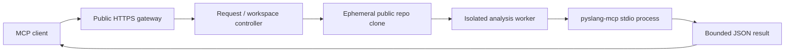
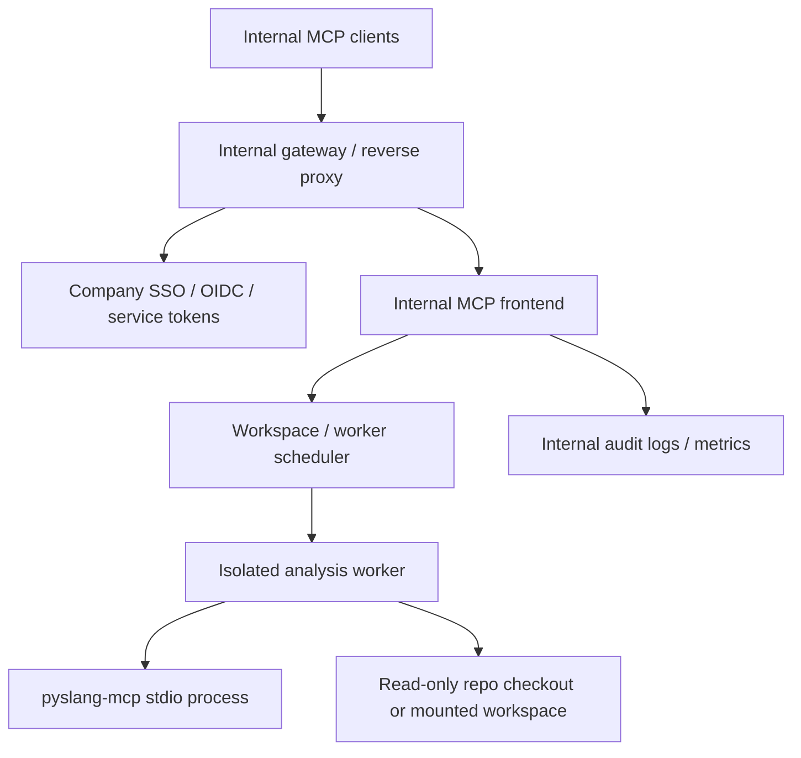

# Remote MaaS Deployment Plan

> [!CAUTION]
> DESIGN ONLY. The current alpha implementation is a local `stdio` MCP server.
> The experimental `streamable-http` transport can be used for the single-server
> internal alpha path with a bearer token, but it is not a complete production
> hosted security boundary by itself.

This document describes the planned MaaS direction for `pyslang-mcp`.
Here, MaaS means a remotely reachable MCP service that exposes the same
compiler-backed, read-only HDL analysis tools through a managed or
self-hosted service boundary.

Hosted access is a separate product surface. Do not describe it as "just run
the current local server over HTTP."

## Product Boundary

`pyslang-mcp` analyzes HDL files on disk under an explicit project root. That
is different from SaaS connectors such as GitHub or Google Sheets, where the
service already hosts the source of truth.

For RTL, the source itself is usually the most sensitive asset. The MaaS plan
therefore has two separate tracks:

| Track | Intended users | Source data | Security stance |
|---|---|---|---|
| Plan A. Public OSS MaaS | open-source hardware users, demos, education, public CI experiments | public repositories only | convenience service, not suitable for confidential RTL |
| Plan B. Internal MaaS | companies doing real RTL design | proprietary repositories and internal workspaces | self-hosted inside the company's own network and controls |

The public service must not be marketed as appropriate for proprietary RTL.
The enterprise answer is an internal deployment pattern, not a shared public
hosted endpoint.

## Plan A. Public OSS MaaS

### Goal

Provide a low-friction hosted service for public Verilog/SystemVerilog
projects so users can try `pyslang-mcp` without installing Python, `pyslang`,
or an MCP server locally.

Positioning:

- hosted semantic analysis for public HDL repositories
- useful for OSS hardware projects, examples, education, and demos
- acceptable for code already intended to be public
- explicitly not for confidential or corporate RTL

### MVP Scope

The first public service should accept:

- a public Git URL
- a branch, tag, or commit SHA
- either a filelist or explicit source files
- optional include directories, defines, and top modules

It should expose the existing V1 tools:

- `pyslang_parse_files`
- `pyslang_parse_filelist`
- `pyslang_get_diagnostics`
- `pyslang_list_design_units`
- `pyslang_describe_design_unit`
- `pyslang_get_hierarchy`
- `pyslang_find_symbol`
- `pyslang_dump_syntax_tree_summary`
- `pyslang_preprocess_files`
- `pyslang_get_project_summary`

Do not add simulation, synthesis, waveform access, RTL edits, or arbitrary
command execution.

### Reference Architecture

Implementation notes:

- Keep the analysis server on `stdio` inside the worker.
- Put the network boundary in a thin service wrapper.
- Clone public repos into ephemeral workspaces.
- Run each analysis in a container or equivalent sandbox.
- Enforce CPU, memory, wall-clock, file-count, and output-size limits.
- Cache public repo analysis only when keyed by repo, commit, and project
  configuration.

### Security And Data Policy

Required controls:

- public repositories only in the first version
- no private repository tokens
- no confidential uploads
- no persistent source storage by default
- short-lived workspaces
- project-root path enforcement inside each workspace
- no network egress from analysis workers unless explicitly required for repo
  clone setup
- source excerpts excluded from operational logs by default
- rate limits by IP, user, token, or GitHub identity

User-facing policy:

- "Use only with code you are authorized to send to a third-party hosted
  service."
- "Do not submit proprietary, export-controlled, or confidential RTL."

### Rollout

1. Write the public hosted threat model and acceptable-use text.
2. Build a service wrapper that starts isolated `pyslang-mcp` workers.
3. Publish a container image for the worker.
4. Deploy a small alpha on AWS ECS/Fargate, Cloud Run, Fly.io, or an equivalent
   service.
5. Add observability for request counts, latency, tool errors, worker exits,
   truncation rates, and cost per analysis.
6. Publish as an OSS demo MaaS, not as enterprise-secure hosted EDA.

### Non-Goals

- accepting private repo credentials
- promising corporate confidentiality
- supporting multi-tenant proprietary RTL
- keeping long-lived user workspaces
- replacing local or self-hosted use for serious design work

## Plan B. Internal MaaS

### Goal

Give real RTL teams a quick bring-up path for running `pyslang-mcp` inside
their own infrastructure, close to their repositories, AI tools, and security
controls.

Positioning:

- self-hosted MCP semantic analysis for internal RTL repositories
- company-owned auth, network, storage, logging, and compliance posture
- no source code needs to leave the corporate environment

This is the right answer for proprietary RTL.

### Deployment Patterns

Support these patterns in order:

1. Single-user or small-team internal server.
2. Shared team service with internal auth and repo access.
3. Kubernetes worker pool for multiple projects and teams.
4. Air-gapped or tightly firewalled installation.

### Reference Architecture

The current `pyslang-mcp` analysis core should remain mostly unchanged.
The internal MaaS layer should provide workspace identity, authorization,
process isolation, and operational controls around it.

### Bring-Up Deliverables

Minimum useful package:

- Dockerfile or published container image
- Docker Compose example for a single internal server
- native Python fallback for corporate servers where Docker is not available
- copy-paste MCP client examples for local, dev-server, and internal gateway
  modes
- admin configuration reference
- security guide

Implemented in the repo now:

- `Dockerfile`
- `deploy/internal/docker-compose.yml`
- `deploy/internal/pyslang-mcp.env.example`
- `deploy/internal/systemd/pyslang-mcp.service.example`
- `scripts/setup_internal_maas.py`
- `docs/internal-maas-quickstart.md`
- bearer-token auth for the experimental HTTP transport via
  `PYSLANG_MCP_HTTP_BEARER_TOKEN`
- native Python bring-up steps in `docs/internal-maas-quickstart.md`

Still needed for larger team deployments:

- Helm chart or Kubernetes manifests for a worker pool
- example reverse-proxy configuration
- company SSO/OIDC integration
- multi-workspace routing
- source-safe metrics and audit export

Admin configuration should cover:

- allowed workspace roots or repo sources
- max repository size
- max source file count
- max include/filelist expansion depth
- max diagnostics, symbols, hierarchy depth, and syntax-summary results
- worker CPU and memory limits
- worker timeout
- cache size and retention
- logging policy for source excerpts
- network egress policy

### Security Model

Required controls:

- company-managed authentication
- workspace-scoped authorization
- read-only source mounts or immutable repo snapshots
- project-root enforcement inside the authorized workspace
- per-request timeouts and response limits
- per-user and per-org rate limits
- audit logs for principal, workspace, tool name, timing, response size,
  truncation, and error category
- operational logs that avoid full source contents by default

Preferred controls:

- one isolated worker per session, project, or request
- no shared mutable checkout across unrelated users
- restricted network egress from workers
- image pinning and SBOM publication
- air-gapped install instructions
- dependency pinning for reproducible deployments

### Internal API Shape

Hosted/internal mode should introduce explicit workspace identity instead of
asking clients to name arbitrary host paths.

Recommended request shape:

- `workspace_id`
- optional project-relative root inside the workspace
- `files` or `filelist`
- include directories, defines, and top modules as today

Local mode should preserve the existing `project_root` shape.

### Enterprise Hardening Backlog

- freeze stable JSON schemas for a non-alpha release
- broaden real-world fixture coverage
- document filelist compatibility boundaries
- add configurable path allow/deny policy
- add worker container image and deployment examples
- add health and readiness endpoints for service wrappers
- add source-safe metrics
- add package and container smoke tests from clean environments
- validate Linux distributions used by common corporate compute platforms

### Rollout

1. Keep local `stdio` as the supported base.
2. Publish the self-hosted deployment guide before any hosted claims. Done for
   the single-server alpha path.
3. Build and test the worker container. Initial Dockerfile and Compose path are
   present.
4. Add Docker Compose for a single internal server. Done.
5. Add Kubernetes manifests or Helm chart for shared internal use.
6. Validate on larger internal-style fixture projects.
7. Add production gateway mode with SSO, multi-workspace routing, and audit
   export.

## Shared Design Principles

- Preserve read-only behavior.
- Keep `analysis.py`, `project_loader.py`, `serializers.py`, and `cache.py`
  transport-independent.
- Put auth, workspace identity, and network serving in a separate wrapper or
  module.
- Require explicit workspace/project roots.
- Return compact JSON with truncation metadata.
- Never expose raw host filesystem paths across tenants.
- Do not claim preprocessor fidelity beyond what `pyslang_preprocess_files`
  actually validates.

## Recommendation

The practical answer to "Will `pyslang-mcp` be released on MaaS?" is:

1. Yes, a public hosted service can make sense for open-source HDL projects and
   demos, with clear warnings that it is not for confidential RTL.
2. For real corporate RTL, the right product is a self-hosted internal MaaS
   deployment that companies run inside their own network.

Ship Plan B documentation and deployment artifacts before treating hosted MaaS
as enterprise-ready. Ship Plan A as a convenience/demo surface with strict
public-code boundaries.
