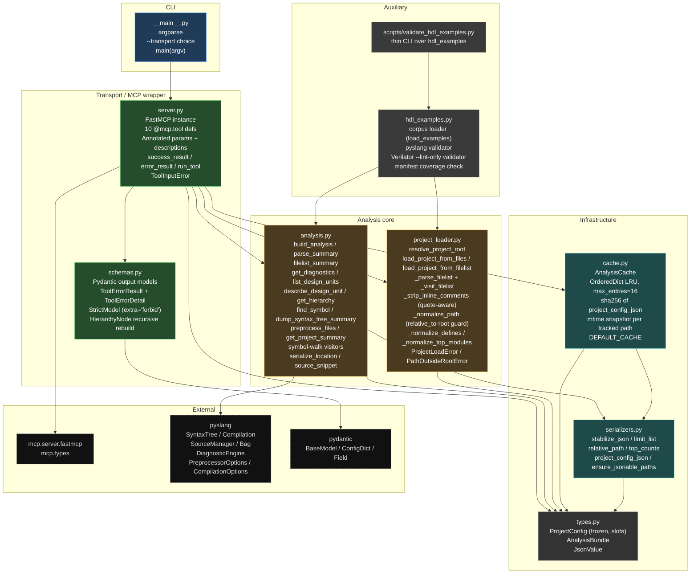
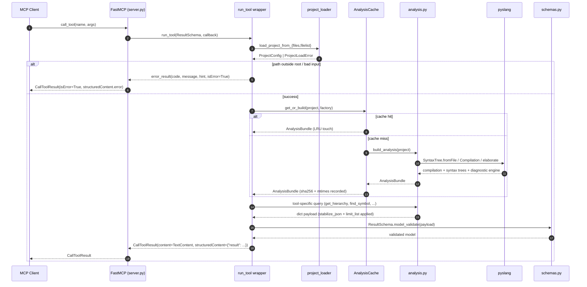

# `pyslang-mcp` Microarchitecture

This document describes the internal module layout of `pyslang-mcp` and how
the pieces cooperate on a single tool call. It is intentionally scoped to
the current alpha implementation — the hosted-deployment direction is
sketched separately in [`../REMOTE_DEPLOYMENT.md`](../REMOTE_DEPLOYMENT.md).

## Module Map

Each node is one Python module inside `src/pyslang_mcp/` (or an external
dependency). Arrows are real import / call edges.

## Tool-Call Sequence

What happens when a client invokes a tool. Diagnostics and load errors
become structured MCP tool errors; success paths return validated
Pydantic payloads in `structuredContent`.

## Responsibility Matrix

| Module | Role | Depends on |
|---|---|---|
| `__main__.py` | CLI. Parses `--transport`, invokes `create_server().run(transport)`. | `server` |
| `server.py` | MCP surface. Registers ten read-only `@mcp.tool`s with `Annotated` input schemas, typed return schemas, and a central `run_tool` wrapper that converts load / input errors into structured tool errors. | `analysis`, `project_loader`, `cache`, `schemas`, `types`, `mcp.server.fastmcp` |
| `schemas.py` | Pydantic output models (one per tool) plus `ToolErrorResult`. `StrictModel` forbids extra keys; `HierarchyNode.model_rebuild()` enables recursive `children`. FastMCP reads these via `Annotated[CallToolResult, Result \| Error]`. | `pydantic` |
| `analysis.py` | pyslang-backed analysis functions. Builds `Compilation`, elaborates, extracts diagnostics, design units, hierarchy, symbols, syntax-tree summaries, and preprocessing metadata. Everything flows through `stabilize_json` + `limit_list`. | `pyslang`, `serializers`, `types` |
| `project_loader.py` | Normalizes and safety-checks project inputs. Resolves project roots, expands nested `.f` filelists (`-f`, `-F`, `+incdir+`, `-I`, `+define+`), records unsupported tokens, and enforces `relative_to(root)` on every path. | `types` |
| `cache.py` | Bounded LRU analysis cache. Key = sha256 of normalized `project_config_json`; invalidation = tuple of `(posix_path, mtime_ns)` over `tracked_paths`. `max_entries=16`. | `serializers`, `types` |
| `serializers.py` | Stable JSON helpers: `stabilize_json` (deep sort), `limit_list` (truncation metadata), `relative_path`, `top_counts`, `project_config_json`, `ensure_jsonable_paths`. | `types` |
| `types.py` | Shared internal types. `ProjectConfig` is frozen and `slots=True` (hashable + safe cache key). `AnalysisBundle` holds the pyslang state. | (stdlib) |
| `hdl_examples.py` | Corpus loader and validators used by the HDL smoke tests and the standalone script. Validates every manifest entry with both pyslang and `verilator --lint-only`. | `analysis`, `project_loader` |
| `scripts/validate_hdl_examples.py` | Thin CLI over `hdl_examples`. `--smoke-only` selects the CI subset. | `pyslang_mcp.hdl_examples` |

## Invariants

- Every tool is read-only (`READ_ONLY_ANNOTATIONS` at `server.py:45-50`).
- Every path the user supplies is rewritten with `Path.resolve()` and
  then checked with `Path.relative_to(project_root)` before any read
  (`project_loader.py:250-273`).
- All list-shaped outputs carry `{returned, total, truncated, remaining}`
  (`serializers.py:25-35`).
- All dict outputs are run through `stabilize_json` so ordering is
  deterministic across runs and across Python hash-seed changes.
- Cache keys include the normalized `ProjectConfig`; entries invalidate
  on any tracked-path mtime change.
- `preprocess_files` is advertised as `mode: "summary_only"` — never
  claim full preprocessor fidelity.

## Extension Points

- **New tool.** Add a Pydantic result model in `schemas.py`, implement
  the query in `analysis.py`, register an `@mcp.tool` in `server.py`
  with `Annotated` args + `run_tool` wrapper.
- **New filelist directive.** Extend the token handlers in
  `project_loader._visit_filelist`; unknown tokens already land in
  `unsupported_filelist_entries`, so tightening coverage there is the
  safest first step.
- **Hosted transport.** Add an authenticated HTTP entry path alongside
  `__main__` (or a new `transport_http.py`), reuse `analysis` / `cache`
  / `project_loader` as-is. See `REMOTE_DEPLOYMENT.md` for the
  workspace-scoped design.
- **Persistent cache.** The `AnalysisCache` interface is intentionally
  small (`get_or_build`, `clear`, `__len__`). A redis- or disk-backed
  implementation can swap in without touching the tool layer.
