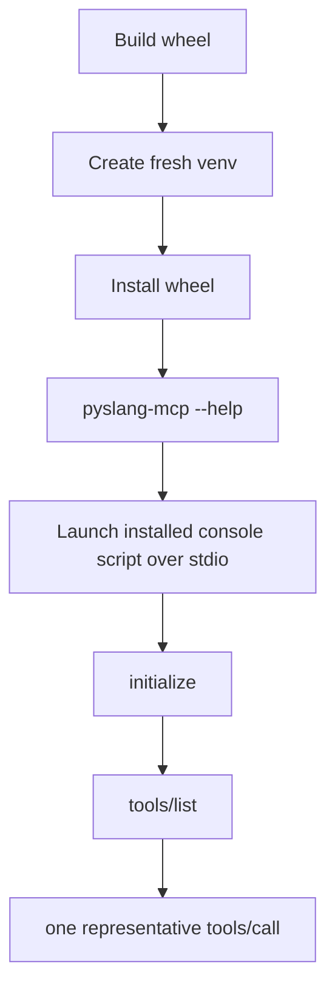
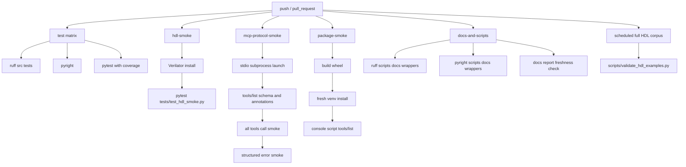

# CI Flow Plan

This plan tracks MCP-specific CI coverage for `pyslang-mcp`.

## Current CI Coverage

The current GitHub Actions workflow has four jobs.

### `test`

Runs on:

- Ubuntu, Python 3.11
- Ubuntu, Python 3.12
- macOS 14, Python 3.12

Checks:

- `ruff format --check src tests`
- `ruff check src tests`
- `pyright`
- `pytest --cov=src/pyslang_mcp --cov-report=xml --cov-report=term-missing:skip-covered -q`

This covers loaders, core analysis functions, direct `FastMCP.call_tool()`
usage, cache behavior, schemas, structured errors, and normal unit/integration
fixtures.

### `hdl-smoke`

Runs on Ubuntu, Python 3.12.

Checks:

- installs Verilator
- installs the package in editable mode
- runs `pytest -q tests/test_hdl_smoke.py`

This validates the `ci_smoke=true` HDL corpus subset with both `pyslang-mcp`
analysis and `verilator --lint-only`.

### `mcp-protocol-smoke`

Runs on Ubuntu, Python 3.12.

Checks:

- installs the package in editable mode
- runs `pytest -q tests/test_mcp_stdio.py`

This now covers the most important missing MCP client path: a real stdio
subprocess session launched with:

```text
python -m pyslang_mcp --transport stdio
```

## MCP Checks Already Covered

`tests/test_mcp_stdio.py` currently verifies:

- real child-process stdio launch with `mcp.client.stdio`
- MCP `initialize`
- `tools/list`
- exact public tool set
- output schemas for every public tool
- read-only tool annotations:
  - `readOnlyHint=true`
  - `destructiveHint=false`
  - `idempotentHint=true`
  - `openWorldHint=false`
- all 10 public tools through a real MCP session
- JSON Schema validation of returned `structuredContent`
- representative structured tool errors:
  - invalid `files` plus `filelist` argument combination
  - explicit source path outside `project_root`
- no Python traceback on server stderr during the smoke run

This means the original `mcp-protocol-smoke` recommendation has been
implemented and wired into CI.

### `package-smoke`

Runs on Ubuntu, Python 3.12.

Checks:

- builds the wheel and sdist
- installs the wheel into a fresh virtual environment
- runs `pyslang-mcp --help` through the installed console script
- launches the installed console script over stdio
- runs MCP `initialize`, `tools/list`, and one representative `tools/call`

This catches broken wheel metadata, missing package files, broken entry points,
and non-editable import behavior before release.

## Remaining CI Gaps

| Priority | Missing CI check | Why it matters | Suggested location |
|---:|---|---|---|
| 1 | Security/path-boundary matrix | The core trust boundary is that the server only reads inside `project_root`. Expand coverage for filelist escape, nested `-f` escape, include-dir escape, symlink escape, and the same failures through MCP stdio calls. | `tests/test_project_loader.py`, `tests/test_mcp_stdio.py` |
| 2 | Evaluation runner for `evaluation.xml` | `evaluation.xml` has MCP Q/A pairs, but CI does not execute them. A deterministic runner would make these product behavior checks instead of documentation. | new test or script |
| 3 | Scripts/docs lint and type checks | CI lints `src tests`, while runnable code also exists in `scripts/` and `docs/mcp_comparison/`. | expand `ruff` / `pyright` scope or add `docs-and-scripts` job |
| 4 | Docs benchmark artifact freshness | `docs/mcp_comparison/run_mcp_comparison.py` regenerates report artifacts, but CI does not check whether checked-in report files are fresh. | `docs-and-scripts` job |
| 5 | Explicit stdout-pollution assertion | The stdio session smoke catches protocol breakage indirectly, but there is no separate focused assertion that startup/tool calls never emit non-protocol stdout. | `tests/test_mcp_stdio.py` |
| 6 | MCP Inspector CLI smoke | Inspector is useful because it mirrors the official MCP debugging workflow. It is less urgent now that the Python stdio client path is covered. | optional `mcp-inspector-smoke` job |
| 7 | Full HDL corpus validation | CI intentionally runs only the smoke subset. Full validation should run on schedule/manual dispatch or when `examples/hdl/**` changes. | scheduled/manual job |
| 8 | Dependency boundary test | The package declares `mcp>=1.27,<2`. CI should eventually test the lowest-supported dependency set or lock a compatibility job. | scheduled/manual or release-gate job |

## Package Smoke Shape

The package smoke job follows this release-gate shape:



Minimum command shape:

```bash
python -m pip install build
python -m build --wheel
python -m venv /tmp/pyslang-mcp-wheel-smoke
/tmp/pyslang-mcp-wheel-smoke/bin/pip install dist/*.whl
/tmp/pyslang-mcp-wheel-smoke/bin/pyslang-mcp --help
```

The stdio portion uses `scripts/package_smoke_stdio.py` and points `command` at
the installed `pyslang-mcp` console script.

## Recommended Next Job

Add the security/path-boundary matrix next.

## Suggested CI Structure



## Near-Term Order

1. Add the security/path-boundary matrix.
2. Add scripts/docs lint coverage.
3. Add an `evaluation.xml` runner.
4. Add scheduled/manual full HDL corpus validation.
5. Add MCP Inspector smoke only if it catches behavior not already covered by
   the Python stdio client smoke.

Keep the normal PR path fast. Put slow corpus and benchmark checks behind
schedule/manual triggers unless the relevant files changed.
